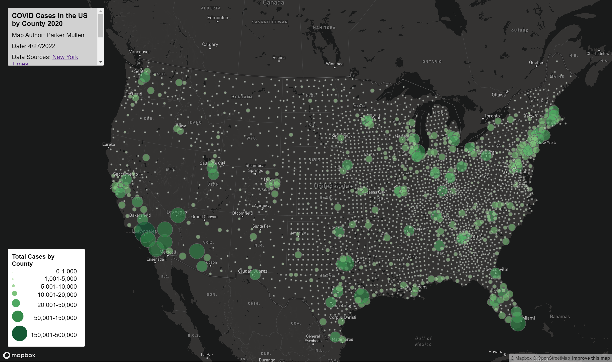

# 2020 Covid Maps
**Parker Mullen**

A map of 2020 covid rates and covid cases based on the [NY Times](https://github.com/nytimes/covid-19-data/blob/43d32dde2f87bd4dafbb7d23f5d9e878124018b8/live/us-counties.csv), and on the ACS [2018 5 year estimate](https://data.census.gov/cedsci/table?g=0100000US%24050000&d=ACS%205-Year%20Estimates%20Data%20Profiles&tid=ACSDP5Y2018.DP05&hidePreview=true).

### Map 1: COVID RATES
[Link to Map 1](https://mullepd.github.io/mullen_covid_map/map1.html)
Using ACS 2018 5 year estimate for population data, and covid casses collected by the New York Times, covid rates were calculated and then mapped by county using a choropleth symbology. Class ranges follow a similar structure to other covid rates maps in other areas.

Primary functions include the ability to hover over a county to view exact covid rates for said county along with the basic ability to pan and zoom.
This map uses the mapbox API and javascript to draw the basemap as well as the thematic layer visualizing covid rates.

### Map 2: COVID CASES
[Link to Map 2](https://mullepd.github.io/mullen_covid_map/map2.html)
Using covid cases collected by the New York Times, raw covid counts were mappend by county using a proportional symbol symbology.

Primary functions include the ability to click on a dot representing a county to see exact covid case counts as well as the ability to pan and zoom.
This map uses the mapbox API and javascript to draw the basemap and the thematic layer visualizing covid counts.
